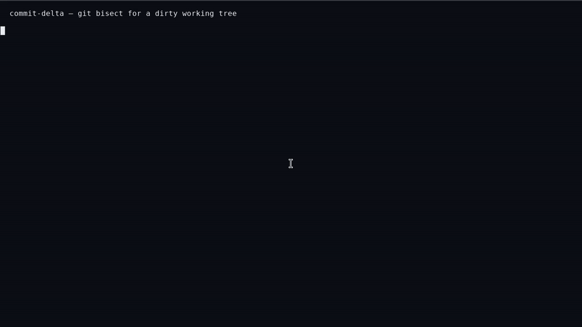

# commit-delta

**git bisect for a dirty working tree.**

You have a known-good `HEAD`, a pile of uncommitted changes, and a
test that fails on the full working tree. `commit-delta` finds a
**minimal failure-inducing change set** — the smallest 1-minimal
subset of those hunks that still fails the test.

It will not tell you that one line is “the cause”. Several hunks may
need each other. Another 1-minimal subset may also fail. The output
is a reduced patch you can read, apply, and hand to a reviewer or
an agent.

```
HEAD:          PASS
Working tree:  14 files, 93 hunks, 567 lines, FAIL

$ commit-delta -- ./reproduce.sh

Minimal failure-inducing change set:

calc.py
  hunk 2
    -        acc = acc + item
    +        acc = acc - item
```

Same failure. 93 hunks → 1 hunk.



[Download the demo as MP4](docs/demo.mp4) — live `xfce4-terminal` capture, 15s.

On a real multi-file Python tree (four feature commits left
uncommitted): **28 files / 2230 lines → 2 files / 69 lines** in about
8 seconds. That run returned *a* 1-minimal fail, not the only one.
Two other independent fails lived in the same tree. That is the
tool working as designed.

## Install

Requires Git 2.5+ (`git worktree`) and Python 3.10+.

```bash
pip install commit-delta
```

From a clone, for development:

```bash
git clone https://github.com/robbyczgw-cla/commit-delta.git
cd commit-delta
python3 -m venv .venv
source .venv/bin/activate   # Windows: .venv\Scripts\activate
pip install -e ".[dev]"
```

## Use

Run the **same command** that is already failing:

```bash
commit-delta -- ./reproduce.sh
commit-delta -- pytest -q
commit-delta --output reduced.patch --json reduced.json -- npm test
```

Everything after `--` is your reproduction command. It runs inside
an isolated worktree. Your dirty tree is only read, never rewritten.

| Goal | Flag |
|---|---|
| Write a patch | `--output reduced.patch` |
| Write JSON (agents) | `--json reduced.json` |
| Log every trial | `--verbose` |
| Confirm flaky FAILs | `--confirm 3` |
| Kill hung tests | `--timeout 60s` |
| Narrow the search | `--include src` / `--exclude tests` |
| Trust exit codes only | `--strict-exits` |

### What your command should return

Same contract as `git bisect run`:

| Exit | Meaning |
|---|---|
| `0` | PASS |
| `125` | UNRESOLVED — this subset cannot build, parse, or import |
| other | FAIL — the failure you want isolated |

If “cannot compile” and “assertion failed” both exit `1`, wrap the
command and map unbuildable subsets to `125`. For Python,
`SyntaxError` / `ImportError` and (when no `AssertionError` appears)
`TypeError` / `AttributeError` are already treated as UNRESOLVED.

The command must work from a **clean checkout plus the candidate
hunks**. The probe tree does not include your `node_modules` or
local virtualenv.

## How it works

1. Verify `HEAD` is GOOD and the full dirty tree is BAD.
2. Snapshot `git diff HEAD -U0` and untracked text files.
3. Reduce at file granularity, then hunk granularity (ddmin).
4. Apply each candidate in a temporary worktree. Cache results.
5. Print a report; optionally write `reduced.patch` and `reduced.json`.

## For coding agents

See **[AGENTS.md](AGENTS.md)**. After tests go red, run once:

```bash
commit-delta --output reduced.patch --json reduced.json -- <the-same-test>
```

Prefer `reduced.json` over scraping the text report. Work only on
that subset. Do not loop. The field `unique_not_guaranteed` is
always true.

## Compared to nearby tools

| Tool | Answers |
|---|---|
| `git bisect` | Which *commit* in history broke? |
| `git add -p` | How do I stage hunks by hand? |
| Shrink Ray / C-Reduce | How do I shrink a failing *input file*? |
| **commit-delta** | Which *uncommitted hunks* still fail the test? |

## Limitations (v0.1)

- Atoms are hunks, not statements. A 40-line rewrite is one piece.
- The result is **a** 1-minimal FAIL set. Uniqueness is not guaranteed.
- Text files only. No binaries, submodules, or ignored build trees.
- The isolated worktree has no local `node_modules` / venv unless
  your command creates them.
- Renames and unusual encodings are best-effort.
- `npm test`, `tsc`, and `cargo` need an exit-`125` wrapper if they
  use `1` for both compile errors and test failures.

Details: [docs/limitations.md](docs/limitations.md).

## Develop

```bash
pip install -e ".[dev]"
make test    # unit + fixture e2e
make bench   # candidate counts / reduction ratios
make demo    # 567-line dirty tree → one hunk
```

| Fixture | Expected reduction |
|---|---|
| A | one bad hunk among 20+ noise hunks |
| B | A and B each pass; A+B fail — both kept |
| C | some subsets do not import — UNRESOLVED, still converges |
| D | two independent minima — returns one |
| E | `--confirm 3` still finds the hunk |
| F | messy refactor, no exit 125 — fat hunk + new file |
| G | four bits must all flip — keeps all four, drops noise |

## Docs

- [AGENTS.md](AGENTS.md) — when to run, what to do with the output
- [docs/algorithm.md](docs/algorithm.md) — ddmin, heuristics, apply
- [docs/limitations.md](docs/limitations.md) — what v0.1 will not do
- [docs/benchmark.md](docs/benchmark.md) — trial counts and the demo
- [docs/competition.md](docs/competition.md) — why this is not git bisect

## License

Apache-2.0. See [LICENSE](LICENSE).
